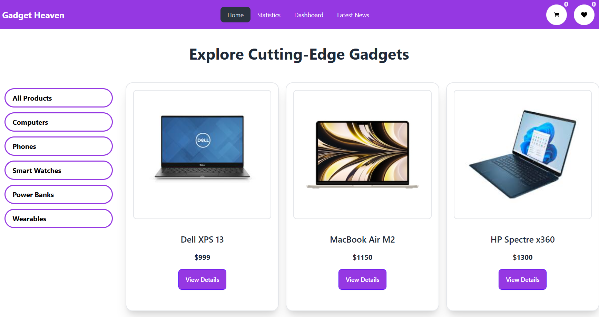

# Gadget Heaven

## Live Link 
- https://nafis-gadget-bd.netlify.app/


## Overview
A frontend site built for gadgets. Users can view gadgets based on their categories, add them to the cart, or add them to the wishlist.

## Features
- View gadgets categorized by type.
- Add gadgets to the shopping cart.
- Add gadgets to the wishlist for later viewing.
- User-friendly UI with smooth navigation.

## Tech Stack
- **React**: Frontend framework
- **React Router**: For navigation
- **React Icons**: Icons for UI enhancement
- **React Helmet**: Manage document head for SEO
- **React Toastify**: Notifications
- **Tailwind CSS & DaisyUI**: Styling and components
- **Vite**: Development bundler

## Installation
### Prerequisites
- Node.js installed
- Package manager (npm or yarn)

### Steps
1. Clone the repository:
   ```sh
   git clone https://github.com/NafisUlAlam/Gadget-BD.git
   ```
2. Navigate to the project directory:
   ```sh
   cd Gadget-BD
   ```
3. Install dependencies:
   ```sh
   npm install
   ```
4. Start the development server:
   ```sh
   npm run dev
   ```

## Dependencies
```json
"dependencies": {
    "prop-types": "^15.8.1",
    "react": "^18.3.1",
    "react-dom": "^18.3.1",
    "react-helmet": "^6.1.0",
    "react-icons": "^5.3.0",
    "react-router-dom": "^6.27.0",
    "react-toastify": "^10.0.6"
  },
  "devDependencies": {
    "@eslint/js": "^9.13.0",
    "@types/react": "^18.3.12",
    "@types/react-dom": "^18.3.1",
    "@vitejs/plugin-react": "^4.3.3",
    "autoprefixer": "^10.4.20",
    "daisyui": "^4.12.14",
    "eslint": "^9.13.0",
    "eslint-plugin-react": "^7.37.2",
    "eslint-plugin-react-hooks": "^5.0.0",
    "eslint-plugin-react-refresh": "^0.4.14",
    "globals": "^15.11.0",
    "postcss": "^8.4.47",
    "tailwindcss": "^3.4.14",
    "vite": "^5.4.10"
  }
```


## Contribution
1. Fork the repository.
2. Create a new branch (`feature-name`).
3. Commit changes and push to GitHub.
4. Open a Pull Request.

## License
This project is licensed under the MIT License.


